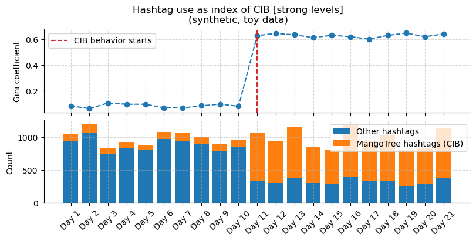
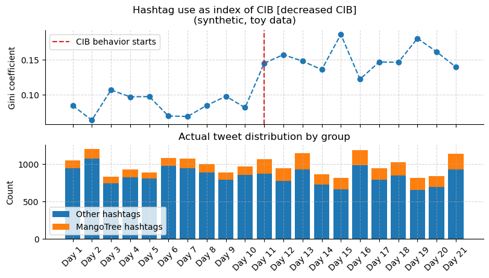

# Detecting Coordinated Behavior Through Hashtag Use -- Toy Scenario

## Simulating CIB in hashtag use
What we do:  
1. We start by simulating a toy scenario of (un)coordinated behavior. We have a bag of about 50 hashtags representing hobbies and other lovely things (that each occurs with equal frequency, 30 times). These tweets represent the uncoordinated behavior.  
1. We then create a few hashtags (generated by the disruptive MangoTree team, argh!) that occur more often by some hand-picked factor (e.g. 10x etc.).  
1. We add uncoordinated tweets into our bag of tweets and randomly sample between 800 and 1200 tweets from the bag 21-times in a row (e.g. each sampling represents a day).
1. **CIB Attack:** On Day 11 we add the injected tweets by the MangoTree team (injection).
1. **Test:** Compute the gini coefficient over the sampled tweets, per each day. (Gini closer to 1 indicates coordination, Gini closer to 0 indicates no coordination).
1. We expect Gini coefficient to increase after Day 11, indicating CIB.

Below we print a random sample of 10 tweets on Day 1 (no CIB) and Day 11 (CIB). We seeg hashtags related to Mangos on Day 11. Gini should pick up on that.

    Day1: #Skiing, #Reading, #Cooking, #Cooking, #Music, #Fitness, #Fitness, #Music, #Antiquing, #Homebrewing
    
    Day11: #Antiquing, #Mangoes, #Mangoes, #LowHangingFruit, #MangoTime, #Surfing, #Music, #Mango, #MangoTime, #Mangoes

## Plotting the gini coefficients over time

Below we plot the obtained gini coefficient in this (extreme) toy scenario. We see that Gini coefficient indeed shoots up at Day 11 (~0.6) when we injected CIB into our bag of tweets. The barplots shows the actual count of mango-related tweets vs. all other tweets, to confirm that Gini is reflecting the data well.

    

    

## Increasing CIB (Gini should go up)
We can now increate the strength of CIB by almost a factor of two and let's check that the Gini reflects that. Indeed the Gini goes over 0.6 (vs. ~0.4 before).

    

    

## Decreasing CIB (lower Gini)
In the same way, we can try to simulate a weaker degree of CIB and redo the analysis. We see that now the Gini coefficient increases, albeat it is much weaker.

    

    

We can compare all three scenarios in the same plot and the same scale to confirm that indeed the test behaves as expected.

    

    

